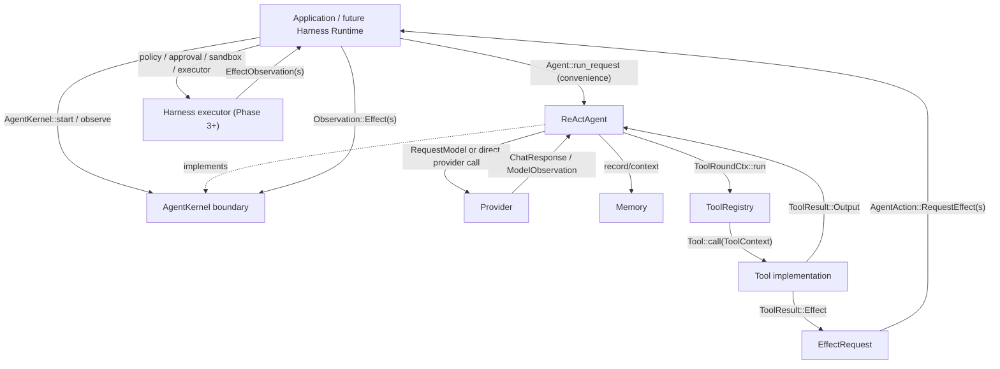
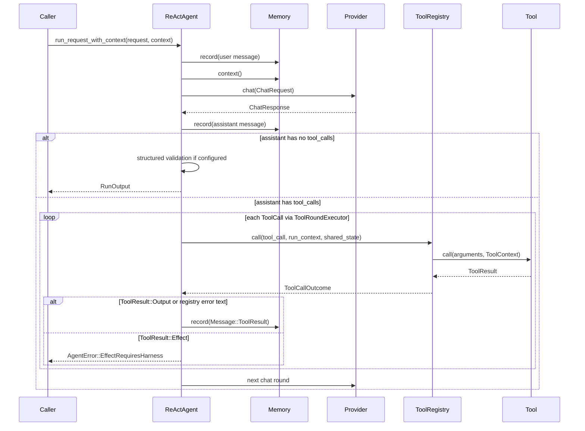
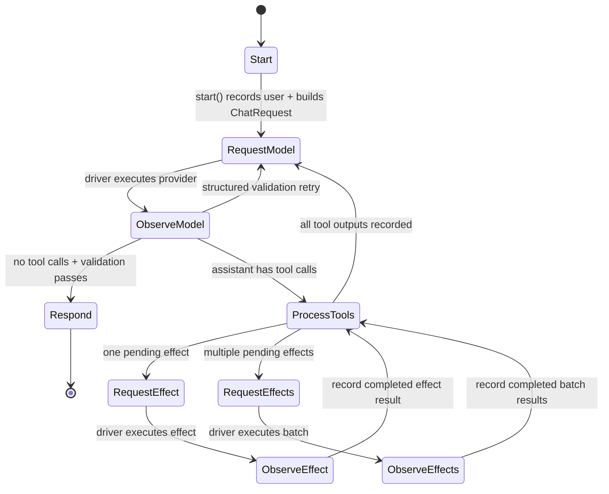
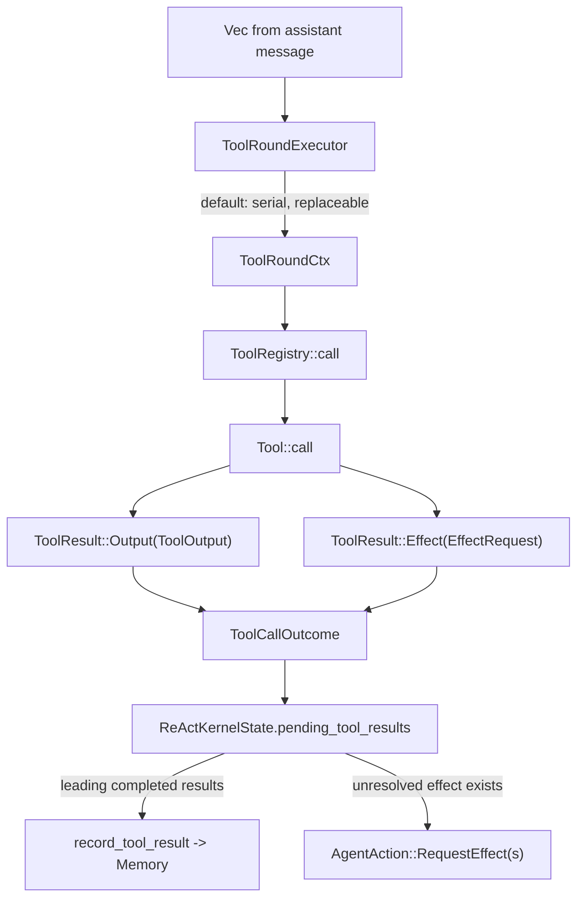

# ReActAgent 内部流程图

本文档帮助阅读 `src/agent/react.rs` 及相关 Tool / Effect 代码。它描述当前实现的调用关系，不是新的架构决策。

核心边界：

- `Agent` 是 high-level convenience driver：自己请求 provider，自己运行普通 tool；遇到 effect-producing tool 时返回 `AgentError::EffectRequiresHarness`。
- `AgentKernel` 是 step-wise 边界：agent 只决定下一步，外层 runtime / future harness 执行 provider request 和 effect request，再把 observation 回灌。
- `Tool::call` 只把模型 tool call 转成 `ToolResult::Output` 或 `ToolResult::Effect`。真正副作用不在 tool 内执行。
- batch / parallel effect 在 Phase 2 只是一种协议表达：`RequestEffects` 表示“这些 effect 可以交给外层一起治理和执行”，是否并行由外层决定。

## 文件地图

| 区域 | 文件 | 关键对象 |
| --- | --- | --- |
| Agent public API | `src/agent/mod.rs` | `Agent`, `AgentKernel`, `AgentAction`, `Observation`, `ModelRequest`, `ModelObservation`, `AgentError` |
| ReAct loop 实现 | `src/agent/react.rs` | `ReActAgent`, `ReActKernelState`, `ToolRoundCtx`, `ToolRoundExecutor`, `ToolCallOutcome` |
| Tool 协议 | `src/tool/mod.rs` | `Tool`, `ToolSchema`, `ToolPolicy`, `ToolContext`, `ToolOutput`, `ToolResult` |
| Tool dispatch | `src/tool/registry.rs` | `ToolRegistry::call`, `RegistryError` |
| Effect 协议 | `src/effect.rs` | `EffectRequest`, `EffectObservation`, `EffectOutput`, `EffectKind`, `RiskLevel` |
| Run 协议 | `src/run.rs` | `RunRequest`, `RunContext`, `RunOutput`, `RunSummary` |
| Message 协议 | `src/message.rs` | `Message`, `ToolCall`, `ContentBlock` |

## 总体职责图



读图要点：

- `ReActAgent` 是一个 loop 实现，不是 harness。
- `ToolRegistry` 负责 lookup、JSON 参数解析、panic 捕获和错误分类。
- effect-producing tool 在 Phase 2 只生成 `EffectRequest`，不会执行 shell、filesystem、git、network 等生产副作用。

## High-level `Agent` 路径

入口：`Agent::run_request_with_context` -> `ReActAgent::run_request_inner` -> `run_rounds_with_context`。



这条路径适合简单 text agent 和纯 tool agent。它不执行 effect，因为没有外层 harness 能做 policy、approval、sandbox、audit。

Streaming 路径结构类似：`run_stream_request_inner` 建立 provider stream，实时 yield `MessageChunk::Delta` / `MessageChunk::ToolCall` / `MessageChunk::ToolResult` / `Done`。如果 tool 产生 effect，stream 以 `EffectRequiresHarness` 错误结束。

## Step-wise `AgentKernel` 路径

入口：外层 driver 调 `AgentKernel::start`，之后根据 `AgentAction` 执行动作并通过 `observe` 回灌结果。



最小 driver 形态：

```rust
let mut action = kernel.start(request, &context).await?;
loop {
    action = match action {
        AgentAction::Respond { output } => return Ok(output),
        AgentAction::RequestModel { request } => {
            let response = provider.chat(request.chat).await?;
            kernel
                .observe(Observation::Model(ModelObservation::new(request.id, response)), &context)
                .await?
        }
        AgentAction::RequestEffect { request } => {
            let observation = harness.execute(request, &context).await?;
            kernel.observe(Observation::Effect(observation), &context).await?
        }
        AgentAction::RequestEffects { requests } => {
            let observations = harness.execute_batch(requests, &context).await?;
            kernel.observe(Observation::Effects(observations), &context).await?
        }
    };
}
```

注意：`harness.execute` / `execute_batch` 还不是 Phase 2 的实现内容。这里的伪代码只说明外层驱动关系。

## Tool round 内部调用关系



`ToolRoundExecutor` 只控制 tool adapter dispatch 策略。默认是串行；应用可以替换成并行 tool dispatch。对于 production side effects，tool adapter 应返回 `EffectRequest`，外层 harness 再执行真正副作用。

## Effect batch 回灌顺序

`RequestEffects` 的关键语义是：外层可以按任意顺序完成 effect，但 kernel 必须按原始 tool-call 顺序写回 `Message::ToolResult`。

示例：模型同一轮发出三个 tool call：

```text
c1 -> pure_before  -> ToolResult::Output("before")
c2 -> read_a       -> ToolResult::Effect(effect-a)
c3 -> read_b       -> ToolResult::Effect(effect-b)
c4 -> pure_after   -> ToolResult::Output("after")
```

kernel 的 pending 状态：

```text
pending_tool_results:
  Outcome(c1, "before")
  Effect(effect-a, c2, observation = None)
  Effect(effect-b, c3, observation = None)
  Outcome(c4, "after")
```

发给外层：

```text
AgentAction::RequestEffects {
  requests: [effect-a, effect-b]
}
```

外层可以并行执行，返回乱序 observation：

```text
Observation::Effects([
  EffectObservation { effect_id: "effect-b", output: "B" },
  EffectObservation { effect_id: "effect-a", output: "A" },
])
```

kernel 匹配后写入 memory 的顺序仍然是：

```text
Message::ToolResult(c1, "before")
Message::ToolResult(c2, "A")
Message::ToolResult(c3, "B")
Message::ToolResult(c4, "after")
```

这样下一次 provider request 中，assistant tool calls 和 tool results 仍保持 provider 期望的配对顺序。

## Observation 校验规则

| 输入 | 当前 pending | 行为 |
| --- | --- | --- |
| `Observation::Model` | 还有 pending tool/effect result | `InvalidStep` |
| `Observation::Effect` | 没有 pending effect | `InvalidStep` |
| `Observation::Effect` | pending effect 多于 1 个 | `InvalidStep`，要求使用 `Observation::Effects` |
| `Observation::Effect` | effect id 不匹配 | `InvalidStep` |
| `Observation::Effects` | 没有 pending effect | `InvalidStep` |
| `Observation::Effects` | 数量不等于 pending effect 数 | `InvalidStep` |
| `Observation::Effects` | 包含未知 effect id | `InvalidStep` |
| `Observation::Effects` | 包含重复 effect id | `InvalidStep` |
| `Observation::Effects` | 顺序不同但 id 完整且唯一 | 接受，按原 tool-call 顺序记录 |

`EffectObservation.status` 可以是 succeeded、denied、failed、cancelled、timed out；这些都属于 effect 已执行后的业务结果，会作为 observation 进入模型上下文。真正的 harness 链路损坏应由未来 harness error 表达，而不是伪装成正常 observation。

## 读代码入口建议

按这个顺序读会比较顺：

1. `src/agent/mod.rs`：先看 `AgentAction` / `Observation` / `AgentKernel`。
2. `src/effect.rs`：看 `EffectRequest`、`EffectOutput`、`EffectObservation`。
3. `src/tool/mod.rs`：看 `ToolResult::Output` 和 `ToolResult::Effect` 的分界。
4. `src/tool/registry.rs`：看 `ToolRegistry::call` 如何补 `EffectRequest.source`。
5. `src/agent/react.rs`：
   - `run_request_inner` / `run_stream_request_inner`：high-level driver。
   - `impl AgentKernel for ReActAgent`：step-wise driver。
   - `observe_model`：处理 provider 成功响应。
   - `process_kernel_pending_tools`：执行 tool adapter，收集 output/effect。
   - `observe_effect` / `observe_effects`：回灌 effect observation。
   - `record_pending_tool_results`：按 tool-call 顺序写 memory。

## 一句话模型

```text
ReActAgent decides next step.
Tool adapter parses model intent.
EffectRequest crosses the safety boundary.
Harness executes outside the agent.
EffectObservation comes back as model-visible tool result.
```
