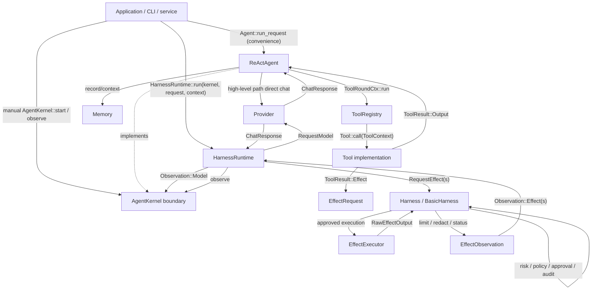
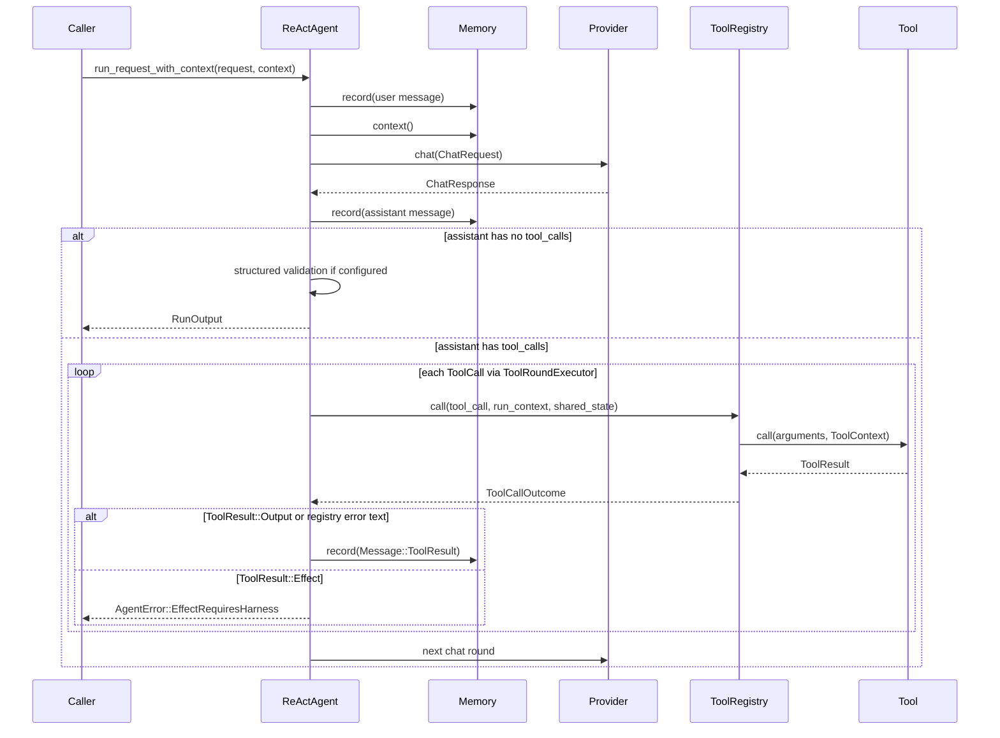
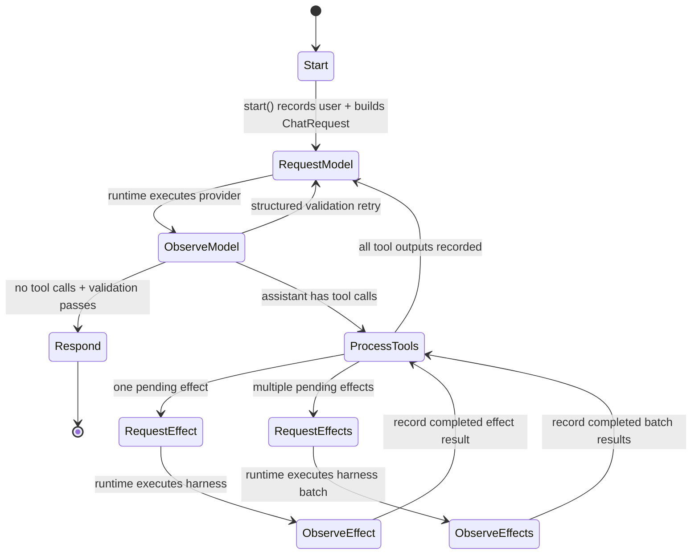
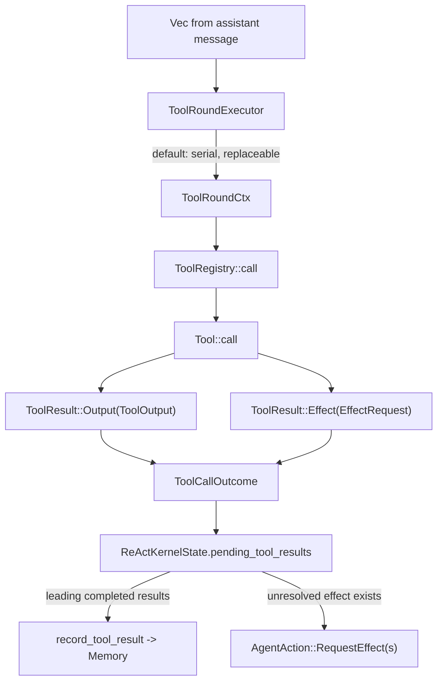
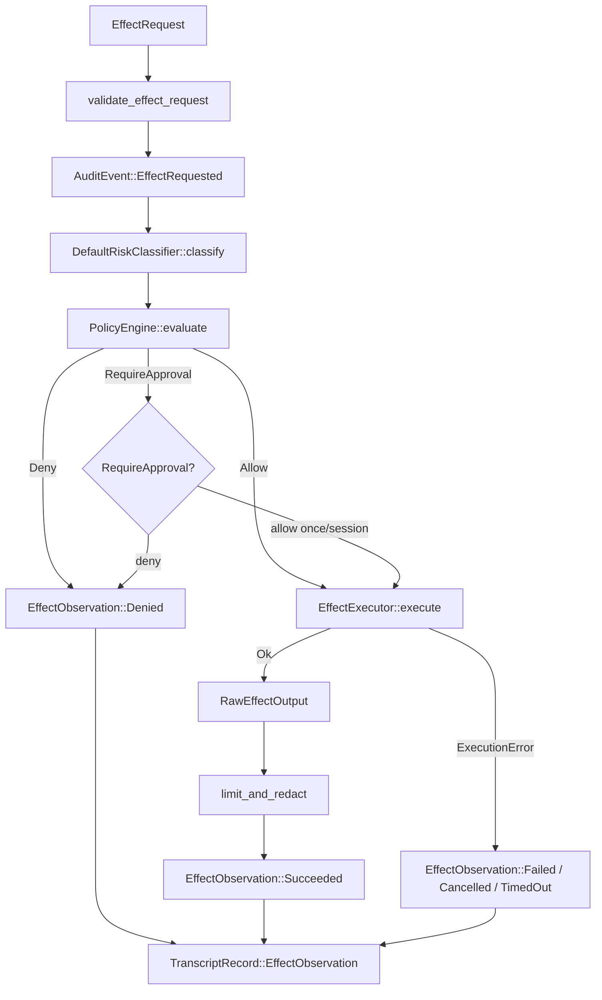

# ReActAgent 与 HarnessRuntime 流程图

本文档说明 high-level `Agent`、step-wise `AgentKernel` 和
`HarnessRuntime` 之间的运行关系，以及 tool、effect、harness observation
如何在一次 agent run 中流转。

核心边界：

- `Agent` 是 high-level convenience driver：自己请求 provider，自己运行普通
  tool；遇到 effect-producing tool 时返回 `AgentError::EffectRequiresHarness`。
- `AgentKernel` 是 step-wise 边界：agent 只决定下一步，外层 runtime 执行
  provider request 和 effect request，再把 observation 回灌。
- `HarnessRuntime` 已实现为可嵌入外层 loop：它持有 `Provider` 和
  `Harness`，驱动任何 `AgentKernel` 到 `RunOutput`。
- `Harness` 治理并执行 effect。内置 `BasicHarness` 组合 risk
  classification、policy、approval、executor、output limiting/redaction、
  audit 和 transcript。
- `Tool::call` 只把模型 tool call 转成 `ToolResult::Output` 或
  `ToolResult::Effect`。真正副作用不在 tool 内执行。
- batch effect 已通过 `AgentAction::RequestEffects` /
  `Observation::Effects` 落地。默认 `Harness::execute_batch` 是顺序执行；
  自定义 harness 可以并行执行，但必须返回完整 observation 集合。

## API 与实现地图

| 区域 | 文件 | 关键对象 |
| --- | --- | --- |
| Agent public API | `src/agent/mod.rs` | `Agent`, `AgentKernel`, `AgentAction`, `Observation`, `ModelRequest`, `ModelObservation`, `AgentError` |
| ReAct loop 实现 | `src/agent/react.rs` | `ReActAgent`, `ReActKernelState`, `ToolRoundCtx`, `ToolRoundExecutor`, `ToolCallOutcome` |
| Harness runtime | `src/harness.rs` | `HarnessRuntime`, `HarnessRuntimeConfig`, `HarnessRuntimeError` |
| Harness lifecycle | `src/harness.rs` | `Harness`, `BasicHarness`, `RiskClassifier`, `PolicyEngine`, `ApprovalBroker`, `EffectExecutor`, `AuditSink`, `TranscriptStore` |
| Tool 协议 | `src/tool/mod.rs` | `Tool`, `ToolSchema`, `ToolPolicy`, `ToolContext`, `ToolOutput`, `ToolResult` |
| Tool dispatch | `src/tool/registry.rs` | `ToolRegistry::call`, `RegistryError` |
| Effect 协议 | `src/effect.rs` | `EffectRequest`, `EffectObservation`, `EffectOutput`, `EffectKind`, `RiskLevel`, `EffectStatus` |
| Run 协议 | `src/run.rs` | `RunRequest`, `RunContext`, `RunOutput`, `RunSummary` |
| Message 协议 | `src/message.rs` | `Message`, `ToolCall`, `ContentBlock` |
| 示例 | `examples/harness_runtime.rs` | `ReActAgent::kernel`, `HarnessRuntime::run`, `BasicHarness` |

## 总体职责图



读图要点：

- `ReActAgent` 是 reasoning loop / kernel 实现，不是 harness。
- `HarnessRuntime` 是 effect-producing agent 的已实现外层 driver。
- `BasicHarness` 负责治理流程，但不内置生产 filesystem、shell、git、
  browser 或 MCP executor；这些属于更高层 coding workload SDK 或应用层。
- `ToolRegistry` 负责 lookup、JSON 参数解析、panic 捕获、错误分类，并为
  `EffectRequest` 补齐 source tool-call 元数据。

## High-level `Agent` 路径

入口：`Agent::run_request_with_context` -> `ReActAgent::run_request_inner` ->
`run_rounds_with_context`。



这条路径适合简单 text agent 和纯 tool agent。它不执行 effect，因为没有外层
harness 能做 policy、approval、sandbox、audit 和 transcript。

Streaming 路径结构类似：`run_stream_request_inner` 建立 provider stream，实时
yield `MessageChunk::Delta` / `MessageChunk::ToolCall` /
`MessageChunk::ToolResult` / `Done`。如果 tool 产生 effect，stream 以
`EffectRequiresHarness` 错误结束。

## HarnessRuntime 路径

入口：应用构造 provider、harness、provider-free kernel，然后调用
`HarnessRuntime::run`。这个路径要求启用 `harness` feature。

```rust
let provider = FakeProvider::new([...]);
let harness = BasicHarness::new(
    executor,
    DefaultPolicyEngine,
    AlwaysAllowApprovalBroker,
    NoopAuditSink,
    NoopTranscriptStore,
);
let runtime = HarnessRuntime::new(provider, harness);

let mut kernel = ReActAgent::kernel(registry, "Answer from governed observations.");
let output = runtime
    .run(&mut kernel, request, RunContext::new("run-1"))
    .await?;
```

Runtime loop 的实际形态：

```rust
let mut action = kernel.start(request, &context).await?;
for _ in 0..config.max_agent_steps {
    let observation = match action {
        AgentAction::Respond { output } => return Ok(output),
        AgentAction::RequestModel { request } => {
            let response = provider.chat(request.chat).await?;
            Observation::Model(ModelObservation::new(request.id, response))
        }
        AgentAction::RequestEffect { request } => {
            Observation::Effect(harness.execute(request, &context).await?)
        }
        AgentAction::RequestEffects { requests } => {
            Observation::Effects(harness.execute_batch(requests, &context).await?)
        }
    };
    action = kernel.observe(observation, &context).await?;
}
return Err(HarnessRuntimeError::TooManyAgentSteps(config.max_agent_steps));
```

错误边界：

| 来源 | Runtime error |
| --- | --- |
| kernel 拒绝 step 或 agent 运行失败 | `HarnessRuntimeError::Agent` |
| provider 通信失败 | `HarnessRuntimeError::Provider` |
| governance infrastructure 失败 | `HarnessRuntimeError::Harness` |
| 超过 runtime step 上限 | `HarnessRuntimeError::TooManyAgentSteps` |

effect 本身被拒绝、执行失败、取消或超时，通常不是 runtime error，而是
`EffectObservation.status`，随后作为 tool result 回灌给模型。

## Step-wise `AgentKernel` 路径

入口：外层 driver 调 `AgentKernel::start`，之后根据 `AgentAction` 执行动作并通过
`observe` 回灌结果。这个 driver 可以是 `HarnessRuntime`，也可以是应用手写 loop。



Kernel 校验和状态规则：

- `Observation::Model` 只能响应当前 `RequestModel`。如果还有 pending
  tool/effect result，会返回 `InvalidStep`。
- `Observation::Effect` 只能用于正好一个 pending effect。
- 多个 pending effect 必须用 `Observation::Effects` 一次性回灌完整集合。
- effect observation 可以乱序返回；kernel 通过 `effect_id` 匹配，并按原始
  tool-call 顺序写回 memory。
- `ReActAgent::kernel(...)` 是给 `HarnessRuntime` 使用的 provider-free
  装配入口；high-level `ReActAgent::new(provider, ...)` 仍保留自驱动路径。

## Tool round 调用关系



`ToolRoundExecutor` 只控制 tool adapter dispatch 策略。默认是串行；应用可以替换
成自定义 tool dispatch。对于 production side effects，tool adapter 应返回
`EffectRequest`，外层 harness 再执行真正副作用。

## BasicHarness 生命周期

`BasicHarness::execute` 对单个 effect 执行完整治理生命周期：



默认策略与配置：

| 项 | 默认行为 |
| --- | --- |
| `DefaultRiskClassifier` | 校验 request，根据 effect kind 和 payload/description 关键词抬高 risk |
| `DefaultPolicyEngine` | `Low` / `Medium` allow，`High` require approval，`Critical` deny |
| `BasicHarness::noop()` | `NoopEffectExecutor` + default policy + always-deny approval，无生产副作用 |
| `Harness::execute_batch` | 默认顺序调用 `execute`，按 request 顺序返回 observations |
| sandbox/network | 默认 `SandboxPolicy::ReadOnly`，`NetworkPolicy::Deny` |
| timeout | 默认 30s，并受 request timeout 和 `RunContext` deadline 约束 |
| audit failure | 默认 fail closed，返回 `HarnessError::Audit` |
| transcript failure | 默认不阻止执行，可配置为 fail closed |

内置 executor 只覆盖边界验证和应用自定义场景：

- `NoopEffectExecutor`：拒绝执行所有 effect，返回 unsupported。
- `StaticEffectExecutor`：按 effect id 返回预设输出，适合测试和示例。
- `RouterEffectExecutor`：按 `EffectKind` 路由到应用提供的 executor。

生产级 filesystem、shell、git、patch、browser、MCP 等执行器不在 core harness
内。它们应在 coding/harness layer 中实现，并通过 `EffectExecutor` 接入。

## Effect batch 回灌顺序

`RequestEffects` 的关键语义是：外层可以按任意顺序完成 effect，但 kernel 必须按
原始 tool-call 顺序写回 `Message::ToolResult`。

示例：模型同一轮发出四个 tool call：

```text
c1 -> pure_before  -> ToolResult::Output("before")
c2 -> read_a       -> ToolResult::Effect(effect-a)
c3 -> read_b       -> ToolResult::Effect(effect-b)
c4 -> pure_after   -> ToolResult::Output("after")
```

kernel 的 pending 状态：

```text
pending_tool_results:
  Outcome(c1, "before")
  Effect(effect-a, c2, observation = None)
  Effect(effect-b, c3, observation = None)
  Outcome(c4, "after")
```

发给外层：

```text
AgentAction::RequestEffects {
  requests: [effect-a, effect-b]
}
```

外层可以并行执行，返回乱序 observation：

```text
Observation::Effects([
  EffectObservation { effect_id: "effect-b", output: "B" },
  EffectObservation { effect_id: "effect-a", output: "A" },
])
```

kernel 匹配后写入 memory 的顺序仍然是：

```text
Message::ToolResult(c1, "before")
Message::ToolResult(c2, "A")
Message::ToolResult(c3, "B")
Message::ToolResult(c4, "after")
```

这样下一次 provider request 中，assistant tool calls 和 tool results 仍保持
provider 期望的配对顺序。

## Observation 校验规则

| 输入 | 当前 pending | 行为 |
| --- | --- | --- |
| `Observation::Model` | 还有 pending tool/effect result | `InvalidStep` |
| `Observation::Effect` | 没有 pending effect | `InvalidStep` |
| `Observation::Effect` | pending effect 多于 1 个 | `InvalidStep`，要求使用 `Observation::Effects` |
| `Observation::Effect` | effect id 不匹配 | `InvalidStep` |
| `Observation::Effects` | 没有 pending effect | `InvalidStep` |
| `Observation::Effects` | 数量不等于 pending effect 数 | `InvalidStep` |
| `Observation::Effects` | 包含未知 effect id | `InvalidStep` |
| `Observation::Effects` | 包含重复 effect id | `InvalidStep` |
| `Observation::Effects` | 顺序不同但 id 完整且唯一 | 接受，按原 tool-call 顺序记录 |

`EffectObservation.status` 可以是 `Succeeded`、`Denied`、`Failed`、
`Cancelled`、`TimedOut`。这些都属于 effect 完成后的业务结果，会作为
observation 进入模型上下文。真正的 harness/runtime 链路损坏由
`HarnessError` / `HarnessRuntimeError` 表达，不伪装成正常 observation。

## API 阅读顺序

按这个顺序读会比较顺：

1. `src/agent/mod.rs`：先看 `AgentAction` / `Observation` / `AgentKernel`。
2. `src/harness.rs`：看 `HarnessRuntime::run`、`Harness`、`BasicHarness` 和
   error 边界。
3. `src/effect.rs`：看 `EffectRequest`、`EffectOutput`、`EffectObservation`。
4. `src/tool/mod.rs`：看 `ToolResult::Output` 和 `ToolResult::Effect` 的分界。
5. `src/tool/registry.rs`：看 `ToolRegistry::call` 如何补
   `EffectRequest.source`。
6. `src/agent/react.rs`：
   - `run_request_inner` / `run_stream_request_inner`：high-level driver。
   - `ReActAgent::kernel`：provider-free kernel 装配入口。
   - `impl AgentKernel for ReActAgent`：step-wise driver。
   - `observe_model`：处理 provider 成功响应。
   - `process_kernel_pending_tools`：执行 tool adapter，收集 output/effect。
   - `observe_effect` / `observe_effects`：回灌 effect observation。
   - `record_pending_tool_results`：按 tool-call 顺序写 memory。
7. `examples/harness_runtime.rs`：看最小已实现 runtime 用法。

## 一句话模型

```text
ReActAgent decides next step.
Tool adapter parses model intent.
EffectRequest crosses the safety boundary.
HarnessRuntime drives provider and harness.
BasicHarness governs the effect lifecycle.
EffectObservation comes back as model-visible tool result.
```
